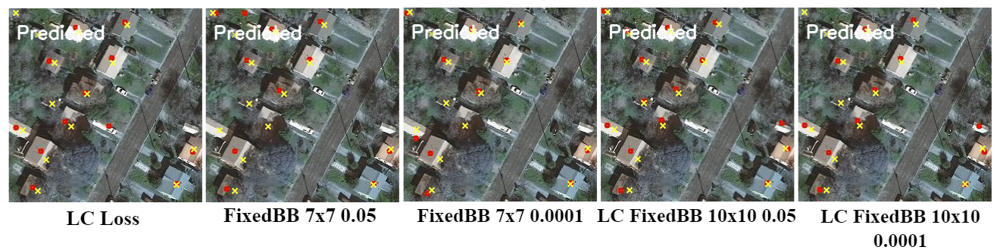

# Code snippets for "Point Supervised Building Identification from Aerial Imagery".
- Tarandeep Singh, Shashank Vatedka, Soumya Jana, Lakshmi Prasad Natarajan
  

## Overview
This repository hosts **partial** implementations related to the proposed loss functions, metrics, and other code snippets from our research paper titled "Point-Supervised Building Identification from Aerial Imagery." To access the complete codebase, please contact us via [email](mailto:ai22mtech02004@iith.ac.in).

## Acknowledgements
Other loss functions and helper codes used in our work are taken from the following repositories:
- [LCFCN: A Loss Function for Counting without Bounding Boxes](https://github.com/ServiceNow/LCFCN) by ServiceNow Research.
- [Locating Objects Without Bounding Boxes](https://github.com/javiribera/locating-objects-without-bboxes) by Javier Ribera.

## Affiliations
 - [Department of Artificial Intelligence, IIT Hyderabad](https://ai.iith.ac.in/)
 - [Department of Electrical Engineering, IIT Hyderabad](https://ee.iith.ac.in/)

